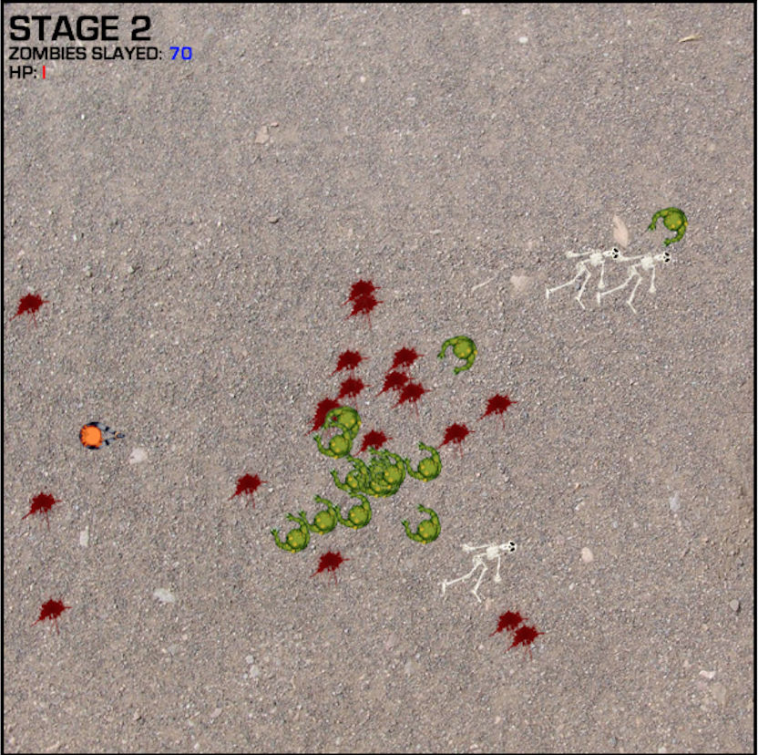

# ZombieSlayer
[Click here to play!](https://conanza.github.io/ZombieSlayer)

## Description
Don't let the world get overrun by zombies!

ZombieSlayer is a simple browser-based overhead shooter game built with HTML5 Canvas and JavaScript.

## Features
* Game mechanics built from the ground up, including collision detection, scoring, respawning, etc.
* Sprite-based drawings and animations done with HTML5 Canvas
* Some silly on-death effects to satisfy the bloodthirsty!
* Utilizes HTML5 Local Storage to keep a local leaderboard stored on the client's browser

## Things to Come
* Smart/safe spawning for player's character
* Spawn zombies on the edge of the map
* More stages for increased difficulty! Faster zombies!
* Powerups!
* Co-op mode
* Global leaderboard
