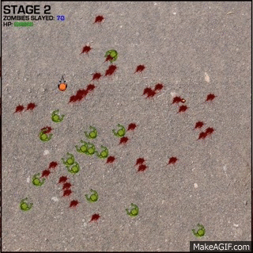

# ZombieSlayer
[Click here to play!](https://conanza.github.io/ZombieSlayer)

## Description
Don't let the world get overrun by zombies!

ZombieSlayer is a simple browser-based overhead shooter game built entirely with JavaScript and HTML5 Canvas.

## Features
* Game mechanics built from the ground up, including collision detection, scoring, respawning, vitality, etc.
* Utilizes my own algorithm (work in progress) to find a safe spawn point after death
* Sprite-based drawings and animations done with HTML5 Canvas
* Some silly on-death effects to satisfy the bloodthirsty!
* Utilizes HTML5 Local Storage to keep a local leaderboard stored on the client's browser
* Utilizes prototypal inheritance for creating the different types of moving objects

## Patch Notes
##### 7/18/15
* Add basic powerups!  
   **Nuke**: BOOM! Clear the map of all zombies.  
   **HP Boost**: Increase your life if you aren't already at full.

##### 7/16/15
* Implement first version of a respawn algorithm for safer respawn for players after death

##### 7/14/15
* Zombies now spawn on the edge of the map

## Things to Come
* [x] Smarter/safer spawning for player's character
* [x] Spawn zombies on the edge of the map
* [ ] Co-op mode
* [ ] Global leaderboard (utilizing a cloud DB)
* [ ] More stages for increased difficulty! Faster zombies!
* [x] Powerups
* [ ] More weapons?!
* [x] Sound effects!
